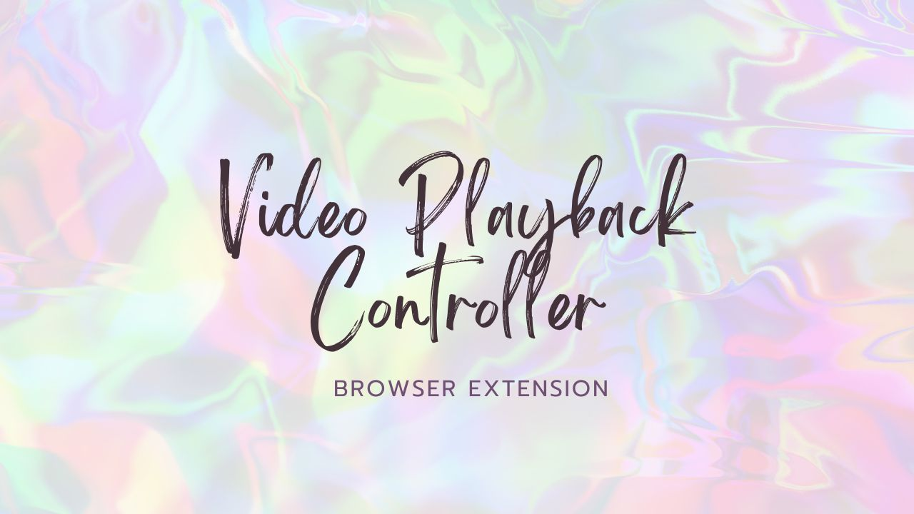
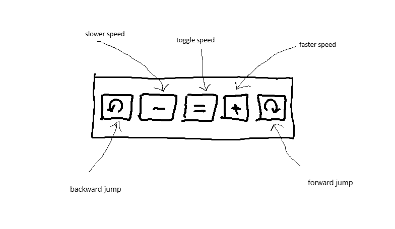

# Video Playback Controller extension

This Chrome extension allows you to easily control video playback on any website. With intuitive buttons for speed and time navigation, you can adjust the speed of your video, jump forwards or backwards, and quickly toggle between popular speed presets.

## Features
- **Backward Jump**: Instantly jump backward by 10 seconds.
- **Decrease Speed**: Reduce video playback speed in increments of 0.1x.
- **Toggle Speed**: Easily toggle between the speeds of 1x, 1.5x, and 2x.
- **Increase Speed**: Increase playback speed in increments of 0.1x.
- **Forward Jump**: Jump forward by 10 seconds for quick navigation.

## Getting Started

### Installation
1. **Clone the repository** or download the zip file and extract it.
2. **Open Chrome** and navigate to `chrome://extensions/`.
3. **Enable Developer Mode** by clicking the toggle switch at the top right of the page.
4. **Click on "Load unpacked"** and select the folder containing the extension files.

You should see the "Video Playback Controller" extension icon appear in your browser toolbar.

## Usage
1. Navigate to any webpage with a video element.
2. Click on the "Video Playback Controller" extension icon in the browser toolbar.
3. Use the following controls:

  | Symbol | Action                          |
  |--------|---------------------------------|
  | ⟲      | Jump 10 seconds backward        |
  | -      | Decrease video speed by 0.1x    |
  | ≡      | Toggle video speed (1x, 1.5x, 2x) |
  | +      | Increase video speed by 0.1x    |
  | ⟳      | Jump 10 seconds forward         |

## Development Process
The development of the "Video Playback Controller" extension followed a straightforward but creative process:

1. **Initial Sketch**: The journey started with a hand-drawn sketch (`sketch.png`). This sketch represented the core concept and design of the control interface, including each button and its intended function.

2. **Generating Code with GPT Vision**: The sketch was used as input for GPT Vision, which helped generate the initial version of the code. GPT Vision converted the visual representation into a working prototype, handling the basics of HTML, CSS, and JavaScript required for the extension.

3. **Manual Refinements**: After generating the initial code, manual refinements were made to enhance the functionality, improve user experience, and polish the overall design. This included adjusting the styling, adding detailed interactions, and debugging issues to ensure the extension worked seamlessly.

## File Overview
- **manifest.json**: Describes the extension and defines permissions.
- **popup.html**: Defines the structure of the extension popup.
- **popup.css**: Adds styles to make the popup UI clean and user-friendly.
- **popup.js**: Contains the logic to handle user interactions and controls the video playback in the active tab.

## Icons Attribution
The icons used in this extension are sourced from [Iconfinder](https://www.iconfinder.com):
- [Player Video Icon](https://www.iconfinder.com/icons/3336959/player_video_icon)
- [Left Rotate Icon](https://www.iconfinder.com/icons/326686/left_rotate_icon)
- [Minus Round Icon](https://www.iconfinder.com/icons/211863/minus_round_icon)
- [Equalizer Option Setup Icon](https://www.iconfinder.com/icons/7549019/user_interface_equalizer_option_setup_setting_ui_icon)
- [Plus Round Icon](https://www.iconfinder.com/icons/211877/plus_round_icon)
- [Right Rotate Icon](https://www.iconfinder.com/icons/352453/right_rotate_icon)

## Contributing
Feel free to open an issue or submit a pull request if you have suggestions or improvements. Contributions are always welcome!

## License
This project is licensed under the MIT License - see the [LICENSE](LICENSE) file for details.

## Acknowledgments
- Inspired by the need for a more intuitive way to control video playback speed.
- Created with the help of GPT Vision, transforming a hand-drawn sketch into a functional Chrome extension.
